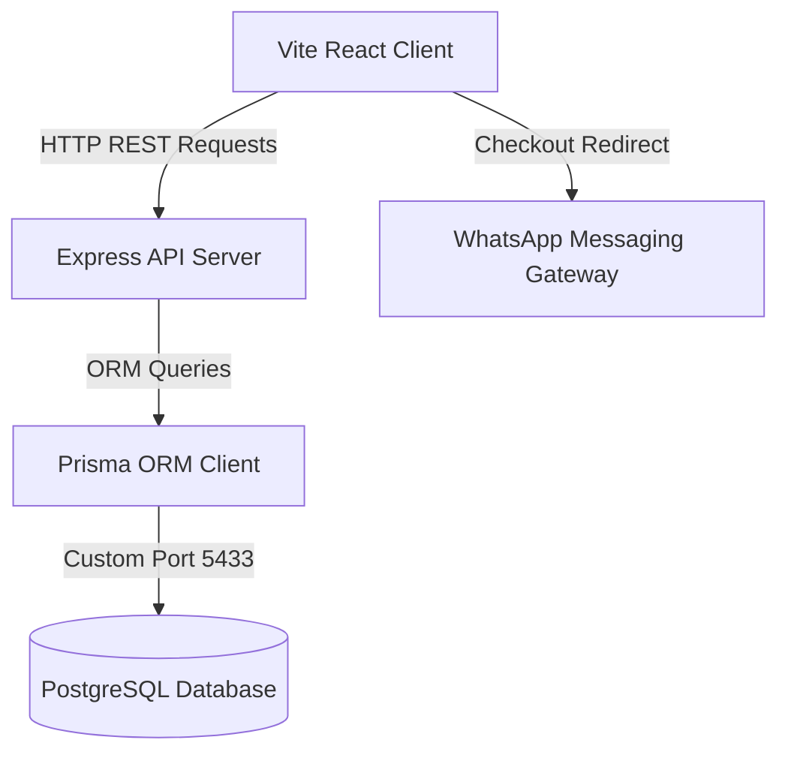

# ARGYR Premium Footwear Platform

ARGYR is a premium, full-stack e-commerce and bespoke shoemaking consultation platform designed for a contemporary Nigerian luxury footwear brand. It merges hand-welted leathercrafting visual aesthetics with a modern, high-contrast, editorial digital shopping experience.

---

## 1. Architectural Overview

The system is split into two clean workspaces: an Express REST API backend and a Vite-powered React client.



### Guest Checkout Funnel:
1. **Browse**: Guests browse shoes in the responsive shop catalog.
2. **Configure**: Select sizes, adjust quantities, review bulk pricing banners (bulk pricing triggers automatically for quantities $\ge 10$).
3. **Cart Submission**: Guest fills out delivery coordinates (Name, WhatsApp, Email, Country, City, Address) without forcing an account creation.
4. **Data Sync**: The backend validates details with Zod, logs order details in PostgreSQL, generates a pre-formatted WhatsApp enquiry message, and returns a tracking record.
5. **Finalize**: The client opens the pre-filled WhatsApp link (`https://wa.me/2348000000000?text=...`) letting the buyer complete payment and shipping terms directly with the sales team.

---

## 2. Technology Stack

*   **Frontend**: React (v18), Vite, TypeScript, Tailwind CSS (v4), Lucide Icons.
*   **Backend**: Node.js, Express, TypeScript, Zod validations, JWT/Cookie-based administrator authentication, Multer file manager.
*   **Database**: PostgreSQL, Prisma ORM.
*   **Testing**: Vitest (backend pricing logic module verification).

---

## 3. Database Schema

The database relies on a structured, normalized schema:

*   **Admin**: Store administrator credentials (encrypted with `bcrypt`).
*   **Category**: Product classifications (e.g., Oxfords, Chelsea Boots, Sneakers) with active status flags and layout sorting coordinates.
*   **Product**: Footwear metadata including stock levels, sizing availability arrays, pricing tiers, material logs, and visibility switches.
*   **ProductImage**: Image assets nested under catalog products, supporting sort orders and zoom previews.
*   **Order**: Guest order checkout logs documenting pricing details, shipping coordinates, and tracking flags.
*   **OrderItem**: Snapshot linking ordered items, quantities, and actual unit prices at checkout.
*   **CustomRequest**: Bespoke design requests documenting custom colors, shoe categories, materials, and reference sketch attachments.
*   **CustomRequestImage**: Reference image attachments uploaded by guest designers.
*   **Setting**: Operational configuration parameters (WhatsApp business number, store name, email) editable in real-time.

---

## 4. Setup & Running Instructions

### Prerequisites
*   Ensure Node.js (v18+) is installed on your workstation.

### Database Setup
The workspace contains a local, self-contained PostgreSQL instance configured under `backend/db_data` running on custom port `5433` (pre-seeded with `trust` bypass parameters). 

If the database daemon needs to be launched manually:
```powershell
postgres -D "backend/db_data" -p 5433
```

### Backend Configurations
1. Navigate to `/backend`.
2. Install dependencies:
   ```bash
   npm install
   ```
3. Sync the Prisma schemas and apply seed data (creates categories, standard products, and default store configurations):
   ```bash
   npx prisma db push
   npx prisma db seed
   ```
4. Create the first default administrator account:
   ```bash
   npm run create-admin
   # Creates: admin@argyr.com / ArgyrSecure2026!
   # Custom credentials can be adjusted in backend/src/scripts/createAdmin.ts
   ```
5. Run the development server:
   ```bash
   npm run dev
   ```

### Frontend Configurations
1. Navigate to `/frontend`.
2. Install dependencies:
   ```bash
   npm install
   ```
3. Set the API address inside `frontend/.env`:
   ```env
   VITE_API_URL="http://localhost:5000/api"
   ```
4. Run the frontend development server:
   ```bash
   npm run dev
   ```
5. Build the application for production release:
   ```bash
   npm run build
   ```

---

## 5. System Test Execution

Verify the authoritative backend bulk pricing calculator (which tests standard prices, bulk thresholds, and null fallback criteria):

```bash
cd backend
npm run test
```

---

## 6. Real-time REST API Endpoints

### Public Shopper Endpoints:
*   `GET /api/products` — Filter products by category, gender, size, price bounds, sorting keys, and search query strings.
*   `GET /api/products/:slug` — Fetch details for a specific shoe silhouette.
*   `GET /api/categories` — Get active classifications.
*   `GET /api/settings/public` — Get business email and WhatsApp details.
*   `POST /api/orders` — Log order and generate pre-filled WhatsApp link.
*   `POST /api/custom-requests` — Log custom design consultations (multipart/form-data with file attachments).

### Admin Portal Endpoints (Protected by Secure HTTP-Only Cookie Session):
*   `POST /api/admin/auth/login` — Check admin credentials and set session cookie.
*   `POST /api/admin/auth/logout` — Revoke session cookie.
*   `GET /api/admin/auth/me` — Verify session validity.
*   `GET /api/admin/dashboard/stats` — Query catalog metrics, orders log counts, and out-of-stock items.
*   `GET /api/admin/products` — Manage products listing.
*   `POST /api/admin/products` & `PUT /api/admin/products/:id` — CRUD product definitions.
*   `DELETE /api/admin/products/:id` — Archive product (soft-delete).
*   `POST /api/admin/uploads` — Upload shoe images to local storage.
*   `GET /api/admin/categories` — List classifications.
*   `POST /api/admin/categories` & `PUT /api/admin/categories/:id` — CRUD classifications.
*   `DELETE /api/admin/categories/:id` — Delete category.
*   `GET /api/admin/orders` & `PATCH /api/admin/orders/:id/status` — Modify guest enquiry states.
*   `GET /api/admin/custom-requests` & `PATCH /api/admin/custom-requests/:id/status` — Track bespoke requests.
*   `GET /api/admin/settings` & `PUT /api/admin/settings` — Update operational variables dynamically.
