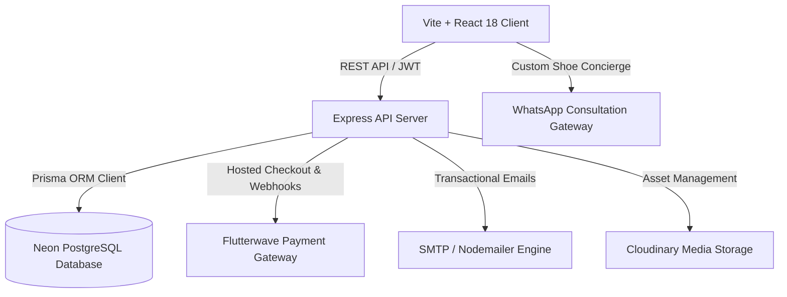

# ARGYR Luxury Footwear E-Commerce Platform

ARGYR is a contemporary luxury footwear e-commerce and bespoke shoemaking platform designed for a premier Nigerian fashion house. It combines artisanal leathercrafting aesthetics with high-performance digital commerce: customer accounts with email OTP verification, authoritative shipping calculation across configurable regions, online payment processing via Flutterwave, automated stock management, luxury transactional emails, and an advanced administrative control center.

---

## 1. Architectural Overview

The system is structured as a full-stack monorepo featuring a TypeScript Express REST API and a high-contrast editorial Vite + React client.



### Complete E-Commerce Checkout Lifecycle:
1. **Catalog Browsing & Bag**: Customers browse footwear silhouettes, select custom sizes/colours, and review real-time bulk discount tiers (discounts apply automatically when quantities reach the threshold).
2. **Authenticated Checkout Gate**: Seamless customer authentication with email OTP verification or one-click sign-in. Guests can sign up or sign in directly from the checkout bag without losing their cart.
3. **Address & Shipping Selection**: Customers choose from saved delivery addresses or input new coordinates. Shipping cost is calculated dynamically based on configurable geographic regions (Lagos Island, Lagos Mainland, Nigeria Outside Lagos, International).
4. **Authoritative Backend Pricing**: The server validates item prices, applies bulk tier pricing rules, checks real-time inventory stock, calculates regional shipping, and secures the order in `PENDING_PAYMENT` state with an estimated delivery timeframe (e.g. *7–14 days*).
5. **Flutterwave Payment**: The customer is redirected to Flutterwave's hosted payment gateway (supporting debit/credit cards, bank transfers, USSD, and international cards).
6. **Verification & Stock Allocation**: Upon payment completion, Flutterwave redirects to `/checkout/confirm` where the server verifies transaction status. The transaction executes an atomic inventory decrement, transitions order status to `PAID`, logs an audit entry in `OrderStatusHistory`, and dispatches branded email receipts to both customer and admin notification recipients.
7. **Idempotent Webhook**: Asynchronous webhooks (`POST /api/payments/webhook`) ensure orders are confirmed even if the shopper closes the browser before returning.
8. **Visual Order Tracking**: Customers monitor production and fulfillment progress via their ARGYR Circle account on an interactive 6-stage order timeline.

---

## 2. Technology Stack

*   **Frontend**: React 18, Vite, TypeScript, Tailwind CSS v4, Lucide Icons, Framer Motion.
*   **Backend**: Node.js, Express, TypeScript, Prisma ORM, Zod validation, JWT authentication, Bcrypt password hashing, Multer file upload.
*   **Database**: Neon Serverless PostgreSQL (with connection pooling and direct DDL migration endpoints).
*   **Payments**: Flutterwave API (hosted payment links, standard verification, cryptographic webhook signature verification).
*   **Email Dispatch**: Nodemailer with luxury responsive HTML templates and safe logging fallback.
*   **Media Storage**: Cloudinary SDK for high-resolution footwear photography and custom sketch uploads.
*   **Testing**: Vitest (backend unit testing suite covering pricing, checkout calculations, and authentication).

---

## 3. Database Schema Highlights

The database runs on PostgreSQL managed via Prisma:

*   **Customer**: Registered shoppers with verified emails, password hashes, and marketing preferences.
*   **CustomerOtp**: 6-digit email verification codes with expiration timestamps and rate-limiting flags.
*   **PasswordResetToken**: Cryptographically secure single-use tokens for customer password resets.
*   **CustomerAddress**: Multiple saved delivery destinations per customer with default address toggles.
*   **Product & Category**: Luxury footwear catalog with multi-size inventory matrices, materials, and bulk tier thresholds.
*   **ShippingMethod**: Configurable regional shipping rates (Lagos Island, Lagos Mainland, Nigeria Outside Lagos, International) with active switches and pricing.
*   **Order & OrderItem**: Authoritative purchase records with immutable price snapshots, delivery coordinates, shipping snapshots, and fulfillment states.
*   **Payment**: Audit records linking Flutterwave transactions (`txRef`, `transactionId`, payment type, card/account masked details) to store orders.
*   **OrderStatusHistory**: Full audit trail capturing every state change, actor (admin or system), timestamp, internal notes, and customer-visible notes.
*   **AdminNotificationEmail**: Configurable distribution list of administrator emails notified upon new orders.
*   **CustomRequest & CustomRequestImage**: Bespoke footwear commissions with uploaded design references.
*   **Setting**: Global store parameters (estimated delivery timeframe, WhatsApp concierge number, default currency).

---

## 4. Setup & Running Instructions

### Prerequisites
*   Node.js (v18+)
*   Neon PostgreSQL database account (or standard PostgreSQL instance)
*   Cloudinary account (for image hosting)
*   Flutterwave account (sandbox or live credentials)

### Backend Configuration
1. Navigate to `/backend`:
   ```bash
   cd backend
   npm install
   ```
2. Create `.env` based on `.env.example`:
   ```env
   PORT=5000
   NODE_ENV=development
   FRONTEND_URL="http://localhost:5173"

   DATABASE_URL="postgresql://...neon.tech/neondb?sslmode=require&pgbouncer=true"
   DIRECT_URL="postgresql://...neon.tech/neondb?sslmode=require"

   JWT_SECRET="your-super-secret-jwt-key"
   ARGYR_WHATSAPP_NUMBER="2348000000000"

   CLOUDINARY_CLOUD_NAME="your-cloud-name"
   CLOUDINARY_API_KEY="your-api-key"
   CLOUDINARY_API_SECRET="your-api-secret"

   # Flutterwave Gateway
   FLW_PUBLIC_KEY="FLWPUBK_TEST-xxxxxxxxxxxxxxxxxxxx-X"
   FLW_SECRET_KEY="FLWSECK_TEST-xxxxxxxxxxxxxxxxxxxx-X"
   FLW_ENCRYPTION_KEY="FLWSECK_TESTxxxxxx"
   FLW_WEBHOOK_SECRET_HASH="argyr_flw_secret_hash_2026"

   # SMTP Transactional Emails (e.g. Resend, SendGrid, or standard SMTP)
   SMTP_HOST="smtp.resend.com"
   SMTP_PORT=587
   SMTP_USER="resend"
   SMTP_PASS="re_xxxxxxxxxxxxxxxx"
   SMTP_FROM="ARGYR Footwear <orders@argyrworldwide.com>"
   SMTP_SECURE=false
   ```
3. Push Prisma schema and seed initial shipping methods and settings:
   ```bash
   npx prisma db push
   npx ts-node src/scripts/seedShippingAndSettings.ts
   ```
4. Create default administrator account:
   ```bash
   npm run create-admin
   # Creates: admin@argyr.com / ArgyrSecure2026!
   ```
5. Start backend development server:
   ```bash
   npm run dev
   ```

### Frontend Configuration
1. Navigate to `/frontend`:
   ```bash
   cd frontend
   npm install
   ```
2. Configure API endpoint in `.env`:
   ```env
   VITE_API_URL="http://localhost:5000/api"
   ```
3. Start frontend development server:
   ```bash
   npm run dev
   ```
4. Build for production:
   ```bash
   npm run build
   ```

---

## 5. Automated Unit & Integration Tests

Run the test suite verifying customer authentication, password hashing, bulk pricing, shipping calculations, and checkout validation:

```bash
cd backend
npm run test
```

---

## 6. REST API Reference

### Customer Authentication & Profile:
*   `POST /api/customer/auth/register` — Register account and send 6-digit email OTP.
*   `POST /api/customer/auth/verify-otp` — Verify email OTP and issue customer JWT.
*   `POST /api/customer/auth/resend-otp` — Resend verification OTP (rate limited).
*   `POST /api/customer/auth/login` — Sign in with email and password.
*   `GET /api/customer/auth/me` — Retrieve active customer session.
*   `POST /api/customer/auth/forgot-password` — Generate password reset token and dispatch email.
*   `POST /api/customer/auth/reset-password` — Complete password reset with secure token.
*   `GET /api/customer/profile` — Fetch customer profile, orders summary, and saved addresses.
*   `PUT /api/customer/profile` — Update customer name and telephone coordinates.
*   `POST /api/customer/addresses` — Add saved delivery address.
*   `DELETE /api/customer/addresses/:id` — Remove saved delivery address.
*   `GET /api/customer/orders` — List customer order history.
*   `GET /api/customer/orders/:id` — Retrieve detailed order breakdown with tracking timeline.

### Checkout & Shipping:
*   `GET /api/shipping/methods` — Retrieve active shipping regions and delivery fees.
*   `POST /api/payments/checkout` — Authenticated checkout initializing order and Flutterwave payment URL.
*   `GET /api/payments/verify` — Server-side Flutterwave verification, stock decrement, and order finalization.
*   `POST /api/payments/webhook` — Flutterwave webhook listener with cryptographic hash verification.

### Public Catalog & Bespoke Studio:
*   `GET /api/products` — Filter products by category, gender, size, price, and status.
*   `GET /api/products/:slug` — Single footwear model specification.
*   `GET /api/categories` — Active footwear classifications.
*   `GET /api/settings/public` — Store metadata, delivery timeframe, and concierge contact.
*   `POST /api/custom-requests` — Bespoke footwear design commission submission with sketch uploads.

### Admin Management Console:
*   `POST /api/admin/auth/login` & `POST /api/admin/auth/logout` — Admin session control.
*   `GET /api/admin/dashboard/stats` — Real-time metrics: verified paid revenue, order volume, customers count, inventory alerts.
*   `GET /api/admin/orders` — Advanced order filtering by status, search query, date, and reference.
*   `GET /api/admin/orders/:id` — Comprehensive order details, items snapshot, payment records, and timeline audit log.
*   `PATCH /api/admin/orders/:id/status` — Advance order status with internal and customer-visible notes; triggers automated status update emails.
*   `GET /api/admin/customers` — Customer directory with order counts and lifetime spend.
*   `GET /api/admin/shipping` & `PUT /api/admin/shipping/:id` — Shipping regions and rate configuration.
*   `GET /api/admin/settings` & `PUT /api/admin/settings` — Update delivery timeframe, concierge WhatsApp, and manage order notification email recipients.
